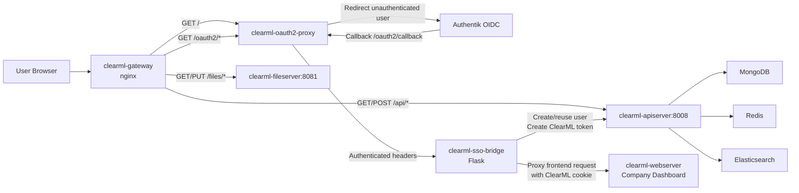
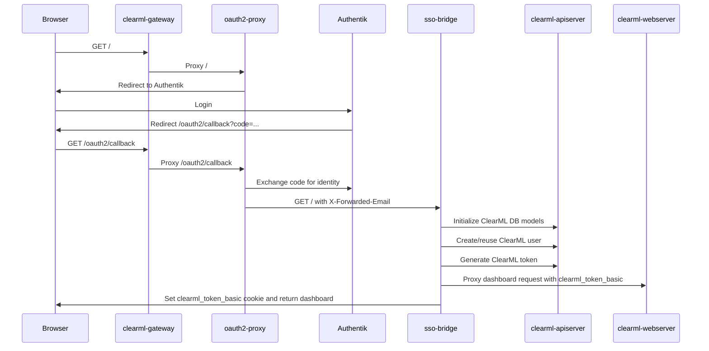
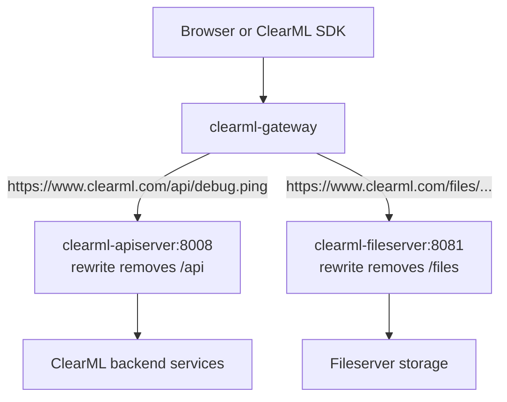
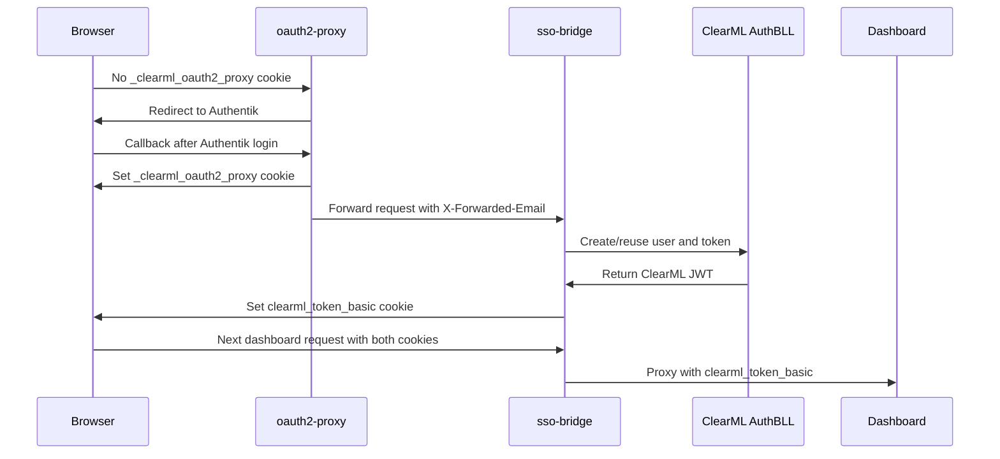
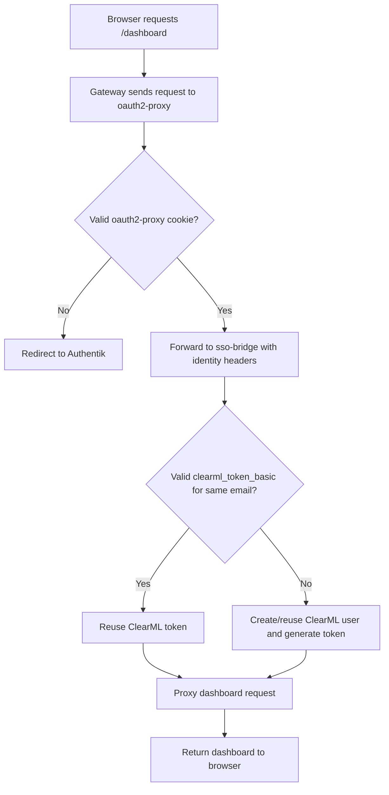

# Authentik SSO File Reference And Flow

Date: 2026-04-28

Branch:

```text
SSO-Integration
```

Main example URL used in this document:

```text
https://www.clearml.com
```

Replace `https://www.clearml.com` with the actual company ClearML URL.

## Purpose

This document explains the SSO-specific files added for the ClearML Authentik integration.

Files covered:

```text
.env.sso.example
docker/docker-compose.local-windows.yml
docker/sso/nginx.conf
docker/sso/oauth2-proxy.cfg
docker/sso/sso_bridge.py
```

The goal of these files is to place Authentik login in front of the ClearML dashboard while still allowing ClearML API and fileserver routes to work through stable public paths:

```text
https://www.clearml.com
https://www.clearml.com/api
https://www.clearml.com/files
```

## High-Level Architecture



## Request Flow: First Login



## Request Flow: API And Files



Important behavior:

```text
/api and /files do not go through oauth2-proxy.
The frontend login path goes through oauth2-proxy.
The ClearML SDK can still use API credentials against /api.
```

# File 1: `.env.sso.example`

Path:

```text
.env.sso.example
```

## What This File Does

This is a safe template for creating the real local secret file:

```text
.env.sso
```

The real `.env.sso` file is loaded by the `oauth2-proxy` service in Docker Compose. It contains sensitive values and must not be committed.

## Variables

```env
OAUTH2_PROXY_CLIENT_ID=lVru0mTh9BMNuglutpq9359WqPjHg1xp77vEytiH
```

Purpose:

```text
OAuth/OIDC client ID created in Authentik for ClearML.
oauth2-proxy uses this when redirecting users to Authentik and exchanging auth codes.
```

Production note:

```text
Use the real Authentik client ID for the company ClearML application.
```

```env
OAUTH2_PROXY_CLIENT_SECRET=replace-with-authentik-client-secret
```

Purpose:

```text
OAuth/OIDC client secret from Authentik.
oauth2-proxy uses it to prove that it is the registered ClearML OAuth client.
```

Security note:

```text
Never commit the real value.
Only keep the real value in `.env.sso` or a secret manager.
```

```env
OAUTH2_PROXY_COOKIE_SECRET=00000000000000000000000000000000
```

Purpose:

```text
Secret used by oauth2-proxy to sign/encrypt its own login session cookie.
It must be exactly 16, 24, or 32 characters.
```

Production note:

```text
Replace the example with a random 32-character secret.
```

```env
# OAUTH2_PROXY_REDIRECT_URL=https://clearml.example.com/oauth2/callback
```

Purpose:

```text
Optional environment-driven redirect URL if oauth2-proxy config is later changed to read it from the environment.
```

Current note:

```text
The current oauth2-proxy.cfg has redirect_url hardcoded.
If using environment-driven config later, wire this variable into oauth2-proxy.cfg.
```

```env
# OAUTH2_PROXY_COOKIE_SECURE=true
```

Purpose:

```text
Production HTTPS cookie setting.
For real HTTPS URLs, cookies should be secure.
```

```env
# OAUTH2_PROXY_OIDC_ISSUER_URL=https://authentik.ccixgtestbed.org/application/o/clearml/
```

Purpose:

```text
Optional environment-driven Authentik issuer URL if oauth2-proxy config is later changed to read it from the environment.
```

## How To Use

Create the real local file:

```powershell
Copy-Item .env.sso.example .env.sso
```

Then edit `.env.sso` with real secrets.

For a real company URL:

```env
OAUTH2_PROXY_CLIENT_ID=<real-authentik-client-id>
OAUTH2_PROXY_CLIENT_SECRET=<real-authentik-client-secret>
OAUTH2_PROXY_COOKIE_SECRET=<real-32-character-cookie-secret>
```

# File 2: `docker/docker-compose.local-windows.yml`

Path:

```text
docker/docker-compose.local-windows.yml
```

## What This File Does

This is a Windows/WSL-specific Docker Compose override for Elasticsearch storage.

It changes Elasticsearch from host bind-mounted folders to Docker named volumes:

```yaml
services:
  elasticsearch:
    volumes:
      - clearml_elastic_data:/usr/share/elasticsearch/data
      - clearml_elastic_logs:/usr/share/elasticsearch/logs

volumes:
  clearml_elastic_data:
  clearml_elastic_logs:
```

## Why This Exists

Elasticsearch is sensitive to filesystem locking and permissions.

On Windows/WSL, using the default Linux-style bind mount can cause Elasticsearch lock/permission problems. Docker named volumes avoid most Windows host filesystem permission issues because Docker manages the volume internally.

## What Each Line Means

```yaml
services:
  elasticsearch:
```

This targets the existing `elasticsearch` service from the main Compose file.

```yaml
volumes:
  - clearml_elastic_data:/usr/share/elasticsearch/data
```

Stores Elasticsearch index data in a Docker named volume.

```yaml
  - clearml_elastic_logs:/usr/share/elasticsearch/logs
```

Stores Elasticsearch logs in a Docker named volume.

```yaml
volumes:
  clearml_elastic_data:
  clearml_elastic_logs:
```

Declares the named volumes so Compose can create and manage them.

## When To Use

Use on Windows/WSL:

```powershell
docker compose -f docker\docker-compose.yml -f docker\docker-compose.local-windows.yml up -d
```

For Linux server deployments, this override is usually not required:

```powershell
docker compose -f docker\docker-compose.yml up -d
```

# File 3: `docker/sso/nginx.conf`

Path:

```text
docker/sso/nginx.conf
```

## What This File Does

This file configures the public gateway container:

```text
clearml-gateway
```

It decides where each incoming request should go.

Routing summary:

```text
/healthz  -> gateway itself
/api      -> clearml-apiserver
/files    -> clearml-fileserver
/oauth2/  -> oauth2-proxy
/         -> oauth2-proxy
```

## Top-Level Nginx Settings

```nginx
worker_processes auto;
```

Nginx automatically chooses worker process count based on available CPU.

```nginx
events {
    worker_connections 1024;
}
```

Allows each worker to handle many simultaneous connections.

```nginx
include /etc/nginx/mime.types;
default_type application/octet-stream;
```

Loads standard MIME types so JavaScript, CSS, images, and other assets return correct content types.

```nginx
resolver 127.0.0.11 ipv6=off valid=10s;
```

Uses Docker's internal DNS resolver.

This matters because the config uses variable-based `proxy_pass` for `oauth2-proxy`.

```nginx
large_client_header_buffers 8 32k;
```

Allows larger request headers. OIDC login/callback headers can be larger than normal.

## WebSocket/Upgrade Handling

```nginx
map $http_upgrade $connection_upgrade {
    default upgrade;
    "" close;
}
```

Prepares the correct `Connection` header for upgraded HTTP connections.

This is useful for frontend or backend routes that may use upgrade-style connections.

## Upstreams

```nginx
upstream clearml_api {
    server apiserver:8008;
}
```

Defines the internal ClearML API backend.

```nginx
upstream clearml_files {
    server fileserver:8081;
}
```

Defines the internal ClearML fileserver backend.

## Server Block

```nginx
listen 80 default_server;
server_name _;
```

The gateway listens on container port `80`.

Docker maps host port `8080` to this container port in local usage.

For a company URL like `https://www.clearml.com`, a company reverse proxy can forward traffic to this gateway.

## Proxy Defaults

```nginx
proxy_http_version 1.1;
client_max_body_size 0;
proxy_buffering off;
```

Allows large uploads and streams responses without buffering.

This is important for ClearML artifacts, files, logs, and long-running requests.

```nginx
proxy_buffer_size 128k;
proxy_buffers 8 128k;
proxy_busy_buffers_size 256k;
```

Increases response header/body proxy buffers.

This protects the OIDC callback and authenticated sessions from failing due to large headers.

## `/healthz`

```nginx
location = /healthz {
    add_header Content-Type text/plain;
    return 200 "ok\n";
}
```

Simple gateway health endpoint.

Expected response:

```text
ok
```

## `/api`

```nginx
location /api {
    proxy_pass http://clearml_api;
    rewrite ^/api/?(.*)$ /$1 break;
}
```

Routes public API calls to ClearML apiserver.

Example:

```text
https://www.clearml.com/api/debug.ping
```

is forwarded internally as:

```text
http://apiserver:8008/debug.ping
```

Why rewrite is needed:

```text
ClearML apiserver expects /debug.ping, not /api/debug.ping.
```

## `/files`

```nginx
location /files {
    proxy_pass http://clearml_files;
    rewrite ^/files/?(.*)$ /$1 break;
}
```

Routes fileserver traffic.

Example:

```text
https://www.clearml.com/files/path/to/artifact
```

is forwarded internally as:

```text
http://fileserver:8081/path/to/artifact
```

## `/oauth2/`

```nginx
location /oauth2/ {
    set $oauth2_proxy "oauth2-proxy:4180";
    proxy_pass http://$oauth2_proxy;
}
```

Routes OAuth endpoints to oauth2-proxy.

Important paths include:

```text
/oauth2/start
/oauth2/callback
/oauth2/sign_out
```

## `/`

```nginx
location / {
    set $oauth2_proxy "oauth2-proxy:4180";
    proxy_pass http://$oauth2_proxy;
}
```

Routes all frontend/dashboard requests through oauth2-proxy.

This is the SSO protection layer for the dashboard.

Unauthenticated users are redirected to Authentik.

Authenticated users are forwarded to `sso-bridge`.

# File 4: `docker/sso/oauth2-proxy.cfg`

Path:

```text
docker/sso/oauth2-proxy.cfg
```

## What This File Does

This configures:

```text
clearml-oauth2-proxy
```

oauth2-proxy handles the OIDC login flow with Authentik.

It does not create ClearML users directly. It authenticates the user with Authentik, then forwards identity headers to `sso-bridge`.

## Settings Explained

```toml
http_address = "0.0.0.0:4180"
```

oauth2-proxy listens on port `4180` inside Docker.

```toml
provider = "oidc"
provider_display_name = "Authentik"
```

Uses generic OpenID Connect and labels the provider as Authentik.

```toml
oidc_issuer_url = "https://authentik.ccixgtestbed.org/application/o/clearml/"
```

Authentik issuer URL.

For a company deployment, this should match the real Authentik provider issuer.

Example:

```toml
oidc_issuer_url = "https://authentik.company.com/application/o/clearml/"
```

```toml
redirect_url = "http://localhost:8080/oauth2/callback"
```

OAuth callback URL.

For production:

```toml
redirect_url = "https://www.clearml.com/oauth2/callback"
```

The same URL must be registered in Authentik.

```toml
scope = "openid email profile"
```

Requests identity, email, and profile claims.

```toml
email_domains = [ "*" ]
```

Allows any email domain after Authentik authentication.

If the company wants to restrict emails at oauth2-proxy level:

```toml
email_domains = [ "company.com" ]
```

```toml
upstreams = [ "http://sso-bridge:5000/" ]
```

Authenticated requests are forwarded to `sso-bridge`.

```toml
reverse_proxy = true
```

Tells oauth2-proxy it is running behind a reverse proxy/gateway.

```toml
skip_provider_button = true
```

Skips the oauth2-proxy provider selection page and redirects directly to Authentik.

```toml
set_xauthrequest = true
pass_user_headers = true
```

Makes oauth2-proxy send user identity headers to the upstream.

The SSO bridge relies on headers such as:

```text
X-Forwarded-Email
X-Forwarded-User
X-Auth-Request-Email
X-Auth-Request-User
```

```toml
pass_authorization_header = false
pass_access_token = false
```

Does not pass OAuth access tokens to the bridge or frontend.

This keeps the Authentik token out of the ClearML UI path.

```toml
session_cookie_minimal = true
```

Keeps oauth2-proxy session cookie smaller.

This helps reduce large callback/session headers.

```toml
code_challenge_method = "S256"
```

Enables PKCE with SHA-256.

```toml
cookie_name = "_clearml_oauth2_proxy"
```

Name of oauth2-proxy's own login session cookie.

This is different from ClearML's cookie:

```text
clearml_token_basic
```

```toml
cookie_secure = false
```

Local HTTP setting.

For production HTTPS:

```toml
cookie_secure = true
```

```toml
cookie_samesite = "lax"
```

Allows normal login redirects while protecting against cross-site cookie abuse.

```toml
cookie_refresh = "0"
```

Disables refresh behavior.

This is compatible with `session_cookie_minimal = true`.

```toml
cookie_expire = "8h"
```

oauth2-proxy login session lasts 8 hours.

```toml
insecure_oidc_allow_unverified_email = true
```

Allows users even if Authentik does not populate or enforce the `email_verified` claim.

Use this only when Authentik itself is the trusted identity authority.

# File 5: `docker/sso/sso_bridge.py`

Path:

```text
docker/sso/sso_bridge.py
```

## What This File Does

This Flask service connects Authentik login to ClearML login.

oauth2-proxy proves the user authenticated with Authentik.

The SSO bridge then:

```text
1. Reads the authenticated email from oauth2-proxy headers.
2. Creates or reuses a ClearML user.
3. Creates or reuses a ClearML company/workspace.
4. Generates a ClearML JWT using ClearML backend code.
5. Sets the ClearML session cookie.
6. Proxies the request to the ClearML dashboard.
```

## Important Constants And Globals

```python
CLEARML_ROOT = os.getenv("CLEARML_ROOT", "/opt/clearml")
```

Location of ClearML server code inside the container.

The bridge adds this path to `sys.path` so it can import ClearML internals.

```python
LOG_LEVEL = os.getenv("SSO_BRIDGE_LOG_LEVEL", "INFO").upper()
```

Controls bridge logging level.

```python
app = Flask(__name__)
```

Creates the Flask app.

```python
_db_initialized = False
```

Tracks whether ClearML database initialization has already happened.

```python
EMAIL_RE = re.compile(...)
```

Basic email validation regex.

```python
HOP_BY_HOP_HEADERS = {...}
```

Headers that should not be forwarded from upstream responses.

This includes:

```text
content-encoding
content-length
connection
transfer-encoding
upgrade
```

This is important because Python `requests` may already decompress content. Forwarding stale `Content-Encoding` or `Content-Length` can break browser rendering.

## Environment-Based Settings

```python
COOKIE_NAME = os.getenv("CLEARML_SESSION_COOKIE_NAME", "clearml_token_basic")
```

ClearML session cookie name.

```python
COOKIE_SECURE = env_bool("SSO_CLEARML_COOKIE_SECURE", False)
```

Whether the ClearML cookie is HTTPS-only.

For production HTTPS:

```text
SSO_CLEARML_COOKIE_SECURE=true
```

```python
COOKIE_HTTPONLY = env_bool("SSO_CLEARML_COOKIE_HTTPONLY", True)
```

Prevents JavaScript from reading the ClearML session cookie.

```python
COOKIE_DOMAIN = os.getenv("SSO_CLEARML_COOKIE_DOMAIN") or None
```

Optional cookie domain.

Usually leave empty unless the company intentionally wants cookies shared across subdomains.

```python
COOKIE_SAMESITE = os.getenv("SSO_CLEARML_COOKIE_SAMESITE", "Lax")
```

Controls browser SameSite behavior.

```python
TOKEN_EXPIRATION_SEC = env_int("SSO_CLEARML_TOKEN_EXPIRATION_SEC")
```

ClearML token expiration in seconds.

```python
CLEARML_WEB_UPSTREAM = os.getenv("CLEARML_WEB_UPSTREAM", "http://webserver").rstrip("/")
```

The internal frontend/dashboard upstream.

For the built-in ClearML webserver:

```text
http://webserver
```

For a custom dashboard on another port:

```text
http://webserver:<port>
```

```python
CLEARML_SERVER_SUB_PATH = os.getenv("CLEARML_SERVER_SUB_PATH", "")
```

Frontend subpath value returned in `/env.js`.

For root deployment:

```text
""
```

```python
DEFAULT_ROLE = os.getenv("SSO_CLEARML_DEFAULT_ROLE", "user")
```

Role assigned to newly created SSO users.

```python
DEFAULT_COMPANY_ID = os.getenv("SSO_CLEARML_COMPANY_ID")
```

Optional fixed ClearML company ID.

If set, all SSO users can be placed under the same company/workspace.

```python
WORKSPACE_MODE = os.getenv("SSO_CLEARML_WORKSPACE_MODE", "company").strip().lower()
```

Controls workspace behavior.

Current default:

```text
company
```

This means each SSO email gets a deterministic company ID.

## Function Reference

## `env_bool(name, default=False)`

Purpose:

```text
Reads an environment variable and converts common true values into Boolean true.
```

Returns `True` for:

```text
1
true
yes
on
```

Used by:

```text
COOKIE_SECURE
COOKIE_HTTPONLY
```

## `env_int(name, default=None)`

Purpose:

```text
Reads an environment variable and converts it to an integer.
```

Used by:

```text
TOKEN_EXPIRATION_SEC
```

If the variable is empty or missing, it returns the default.

## `init_db()`

Purpose:

```text
Initializes ClearML database connections inside the bridge process.
```

What it does:

```text
1. Skips if DB was already initialized.
2. Ensures /var/log/clearml exists.
3. Imports ClearML apiserver database module.
4. Calls db.initialize().
5. Marks DB as initialized.
```

Why it matters:

```text
The bridge uses ClearML's own MongoDB models and AuthBLL.
Those require ClearML database initialization.
```

## `first_header(*names)`

Purpose:

```text
Returns the first available request header from a list of possible names.
```

Why it exists:

```text
Different OAuth/proxy setups may pass identity using slightly different header names.
```

Example headers:

```text
X-Forwarded-Email
X-Auth-Request-Email
X-Forwarded-User
X-Auth-Request-User
```

If a header contains comma-separated values, it returns the first value.

## `normalize_email(value)`

Purpose:

```text
Cleans and validates an email address.
```

What it does:

```text
1. Handles empty values.
2. Trims whitespace.
3. Converts to lowercase.
4. Validates using EMAIL_RE.
5. Returns empty string if invalid.
```

This prevents invalid identity headers from creating ClearML users.

## `display_name_from_headers(email)`

Purpose:

```text
Builds a display name for the ClearML user.
```

It checks these headers:

```text
X-Forwarded-Name
X-Auth-Request-Preferred-Username
X-Forwarded-Preferred-Username
X-Auth-Request-User
X-Forwarded-User
```

If none are present, it uses the email address.

## `company_id_for_email(email)`

Purpose:

```text
Determines which ClearML company/workspace the SSO user belongs to.
```

Behavior:

```text
1. If SSO_CLEARML_COMPANY_ID is set, use that fixed company ID.
2. If workspace mode is shared/default, use ClearML's default company.
3. Otherwise, generate a deterministic company ID from the email.
```

The deterministic ID is created using:

```python
sha256(f"clearml-sso:{email}".encode("utf-8")).hexdigest()[:32]
```

Why this matters:

```text
The same email always maps to the same ClearML company.
Different emails do not collide in normal usage.
```

## `ensure_company(company_id, email)`

Purpose:

```text
Ensures the ClearML company/workspace exists for the SSO user.
```

What it does:

```text
1. Checks if a Company document already exists.
2. Creates it if missing.
3. Ensures the company has a default queue.
```

Created company name format:

```text
sso-<email>
```

The name is truncated to 120 characters.

## `ensure_clearml_user(email)`

Purpose:

```text
Ensures a ClearML auth user exists for the authenticated SSO email.
```

What it does:

```text
1. Initializes DB.
2. Looks for an existing ClearML auth user by email.
3. If found, marks the user as validated and returns it.
4. If missing, determines the company ID.
5. Ensures the company exists.
6. Builds a CreateUserRequest.
7. Calls AuthBLL.create_user().
8. Marks the user autocreated and validated.
9. Returns the created user.
```

ClearML internals used:

```text
CreateUserRequest
AuthBLL
User model
```

## `existing_token_for_email(email)`

Purpose:

```text
Reuses an existing ClearML session token if it already belongs to the authenticated email.
```

What it does:

```text
1. Reads the clearml_token_basic cookie.
2. If missing, returns None.
3. Decodes token identity using ClearML Token.
4. Looks up the token user in MongoDB.
5. Confirms token user's email matches the SSO email.
6. Returns token only if it matches.
```

Security importance:

```text
A stale or mismatched ClearML cookie is not trusted.
The bridge only reuses a token if it belongs to the same authenticated SSO email.
```

## `create_clearml_token(user)`

Purpose:

```text
Creates a ClearML JWT/session token for the user.
```

It calls:

```python
AuthBLL.get_token_for_user(
    user_id=user.id,
    company_id=user.company,
    expiration_sec=TOKEN_EXPIRATION_SEC,
).token
```

This means the bridge uses ClearML's official token-generation logic instead of inventing its own token format.

## `target_url()`

Purpose:

```text
Builds the internal dashboard upstream URL for the current request.
```

Example:

```text
Incoming request: /dashboard?x=1
CLEARML_WEB_UPSTREAM: http://webserver
Target URL: http://webserver/dashboard?x=1
```

## `proxied_request_headers(token)`

Purpose:

```text
Builds headers for the request that the bridge sends to the dashboard.
```

What it does:

```text
1. Copies incoming request headers.
2. Drops hop-by-hop headers.
3. Drops Host.
4. Drops Accept-Encoding.
5. Copies incoming cookies.
6. Adds/overwrites the ClearML session cookie.
7. Sets Host to webserver by default.
```

Why it drops `Accept-Encoding`:

```text
The bridge streams responses with Python requests.
Avoiding compressed upstream responses prevents browser rendering issues caused by mismatched encoding headers.
```

## `no_store(response)`

Purpose:

```text
Adds no-cache headers to a Flask response.
```

Headers set:

```text
Cache-Control: no-store, no-cache, must-revalidate, max-age=0
Pragma: no-cache
```

Used for:

```text
/
/env.js
/config/*
```

This prevents the browser from caching stale frontend bootstrap configuration.

## `env_js_response()`

Purpose:

```text
Returns a clean frontend env.js response.
```

Current output:

```javascript
(function (window) {
  window.__env = window.__env || {};
  window.__env.subPath = "";
}(this));
```

Why it exists:

```text
The ClearML web image may serve env.js with an unresolved placeholder.
The bridge overrides /env.js so the frontend receives a valid root-path config.
```

If the company custom dashboard needs more runtime variables, add them here.

Example:

```python
"  window.__env.apiBaseUrl = \"/api\";",
"  window.__env.filesBaseUrl = \"/files\";",
```

## `proxy_to_clearml_web(token)`

Purpose:

```text
Proxies the authenticated frontend request to the dashboard service.
```

What it does:

```text
1. If request is /env.js, returns env_js_response().
2. Otherwise sends the request to target_url().
3. Adds the ClearML token cookie through proxied_request_headers().
4. Streams the upstream response back to the browser.
5. Removes hop-by-hop headers.
6. Adds no-cache headers for frontend bootstrap paths.
```

This is the main function that connects SSO-authenticated browser traffic to the ClearML dashboard.

## `set_clearml_cookie(response, token)`

Purpose:

```text
Sets the ClearML session cookie on the browser response.
```

Cookie name:

```text
clearml_token_basic
```

Cookie settings:

```text
HttpOnly: true by default
Secure: controlled by SSO_CLEARML_COOKIE_SECURE
SameSite: Lax by default
Path: /
Domain: optional
Max-Age: optional
```

For production HTTPS:

```text
SSO_CLEARML_COOKIE_SECURE=true
```

## `health()`

Route:

```text
GET /__sso/health
```

Purpose:

```text
Simple bridge health endpoint.
```

Response:

```text
ok
```

## `bridge(path)`

Routes:

```text
/
/<path:path>
```

Methods:

```text
GET
POST
PUT
PATCH
DELETE
HEAD
OPTIONS
```

Purpose:

```text
Main request handler for all authenticated frontend traffic.
```

Full logic:

```text
1. Read authenticated email from oauth2-proxy headers.
2. Normalize and validate email.
3. If email is missing/invalid, return 401.
4. Try to reuse an existing ClearML token for that email.
5. If no valid token exists, create/reuse ClearML user.
6. Generate a new ClearML token.
7. Proxy request to ClearML dashboard.
8. If token is new, set ClearML cookie on the browser response.
9. Return dashboard response.
```

This function is the main SSO-to-ClearML handoff point.

## `if __name__ == "__main__"`

Purpose:

```text
Runs the Flask app when the file is executed directly.
```

It listens on:

```text
0.0.0.0:5000
```

unless `PORT` is set.

# End-To-End Cookie Flow



Cookie roles:

```text
_clearml_oauth2_proxy: proves Authentik login to oauth2-proxy.
clearml_token_basic: proves ClearML login to ClearML backend/frontend.
```

# What Happens For A Returning User



# Custom Dashboard Notes

If the company uses a customized dashboard image, the `webserver` service in Compose should point to that image.

The SSO bridge does not care whether the dashboard is the default ClearML UI or the company customized UI, as long as the dashboard:

```text
1. Serves HTTP inside Docker.
2. Is reachable by the bridge through CLEARML_WEB_UPSTREAM.
3. Uses /api for backend API calls.
4. Uses /files for fileserver calls.
5. Works with clearml_token_basic cookie.
```

For a custom dashboard on port `80`:

```yaml
CLEARML_WEB_UPSTREAM: http://webserver
```

For a custom dashboard on port `8080`:

```yaml
CLEARML_WEB_UPSTREAM: http://webserver:8080
```

# Production Values Checklist

For a real company URL like:

```text
https://www.clearml.com
```

use:

```text
oauth2-proxy redirect_url: https://www.clearml.com/oauth2/callback
oauth2-proxy cookie_secure: true
sso-bridge SSO_CLEARML_COOKIE_SECURE: true
ClearML web URL: https://www.clearml.com
ClearML API URL: https://www.clearml.com/api
ClearML files URL: https://www.clearml.com/files
```

# File Responsibility Summary

```text
.env.sso.example
```

Commit-safe template for oauth2-proxy secrets.

```text
docker/docker-compose.local-windows.yml
```

Windows/WSL Elasticsearch volume override.

```text
docker/sso/nginx.conf
```

Public routing gateway for dashboard, OAuth, API, and files.

```text
docker/sso/oauth2-proxy.cfg
```

Authentik/OIDC login configuration.

```text
docker/sso/sso_bridge.py
```

Converts Authentik-authenticated users into ClearML-authenticated browser sessions.

